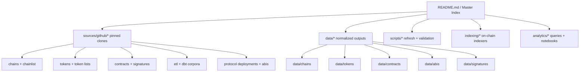
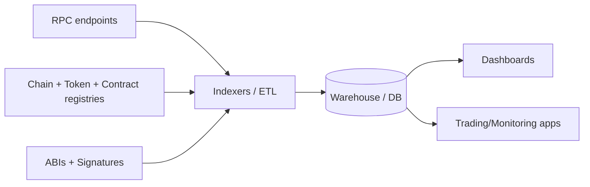

# AI-Ready Resource Repositories for Blockchain Analytics, Dashboards, and Trading Tools

## Executive summary

A production-grade analytics/dashboard/trading stack typically needs four “resource planes” to be reliable and automatable: (1) **chain metadata** (chain IDs + RPCs), (2) **asset metadata** (token lists + icons + decimals), (3) **contract metadata** (addresses/labels + ABIs + event signatures), and (4) **analytics/indexing assets** (schemas + sample queries + ETL/indexing code). The GitHub repositories below are among the most “AI-ready” in that they provide a root README plus structured folders/files suitable for ingestion into an LLM project folder, and they collectively cover most of what you requested. citeturn14search15turn45search0turn27view0turn35view0turn43view0turn45search1turn49view0

A practical “clone set” that gets you closest to **everything** in the fewest repos is:

- **Chain IDs + RPC endpoints (EVM)**: `ethereum-lists/chains` + `DefiLlama/chainlist` (plus `chainlist.org/rpcs.json` as a machine endpoint). citeturn14search15turn8view0turn45search0turn47view0  
- **Token lists and token metadata**: `ethereum-lists/tokens` (contributor-friendly per-token JSON) + `Uniswap/default-token-list` (actively maintained default list used by the Uniswap interface) + `Uniswap/token-lists` (the schema/spec + examples). citeturn27view0turn38view0turn42search0turn43view0  
- **Labeled contract addresses + schemas**: `ethereum-lists/contracts` (project labeling + security contacts + JSON schemas; older but still structurally valuable). citeturn30view0turn31view0  
- **Signature decoding for calldata**: `ethereum-lists/4bytes` (function selector → text signature). citeturn32view0turn34view0  
- **ETL + schemas for analytics warehousing**: `blockchain-etl/ethereum-etl` (extracts blocks/txs/logs/contracts into queryable formats; references BigQuery dataset). citeturn45search1turn45search5  
- **High-value query/model corpora**: `duneanalytics/spellbook` (dbt project with models/sources/docs; Business Source License restrictions apply). citeturn46view2turn44view5turn49view0  

A true single-repo “full house” (covering *all* of ABIs + addresses + chain IDs + token lists + indexing examples + oracle feeds + audits + deployment scripts) is uncommon. The closest pattern in practice is a **single “AI master index repo”** that vendors or links to these authoritative sources and pins versions; a ready-to-drop template and folder tree are provided later in this report.

## Selection criteria and evaluation method

Repositories were prioritized when they (a) have a **root README/index** and stable structure, (b) publish **structured, machine-ingestible artifacts** (JSON/TS/Python/dbt), (c) are clearly used as a “source of truth” by downstream tooling (e.g., ChainList RPCs, Uniswap default list), and (d) have a license that can be safely mirrored into an internal “AI-ready” folder (or clearly states restrictions). citeturn14search15turn45search0turn42search10turn49view0

For “required items coverage,” each repo is mapped against your checklist:

ABIs; contract addresses; chain IDs; RPC endpoints; token lists; math/finance libraries; SDKs; API docs; sample queries; data schemas; event logs/signatures; subgraph examples; on-chain indexing tools; oracle feeds; security/audit reports; deployment scripts.

## Comparison table of top GitHub repositories

| Repo (owner/name) | Primary role in an AI-ready stack | Coverage highlights vs. your checklist | License | Last commit / last pushed | Primary language (as reported by GitHub) |
|---|---|---|---|---|---|
| `ethereum-lists/chains` | Canonical-ish **EVM chain metadata** per CAIP-2 filenames | Chain IDs ✅, RPC endpoints ✅ (in per-chain JSON), explorers/metadata ✅; token lists ❌; ABIs ❌ | MIT citeturn14search15 | Feb 5, 2026 citeturn9view0 | Kotlin citeturn7view0 |
| `DefiLlama/chainlist` | **Public RPC endpoint registry** behind chainlist.org | RPC endpoints ✅, chain metadata ✅, API docs ✅ (`rpcs.json`); token lists ❌; ABIs ❌ | GPL-3.0 citeturn45search0turn47view0 | Updated Mar 5, 2026 citeturn47view0 | JavaScript citeturn47view0 |
| `ethereum-lists/tokens` | Contributor-friendly **per-token JSON** definitions | Token lists ✅ (address/symbol/decimals + optional metadata); chain IDs partial (implied); ABIs ❌ | MIT citeturn27view0 | Jan 12, 2026 citeturn29view0 | Kotlin citeturn27view0 |
| `Uniswap/default-token-list` | Actively maintained **default token list** used in a major DEX UI | Token lists ✅ (multi-chain JSON inputs + build output); schema/spec ❌ (use `Uniswap/token-lists`) | GPL-3.0 citeturn38view0 | Mar 4, 2026 citeturn39view0 | JavaScript citeturn38view0 |
| `Uniswap/token-lists` | **Token list schema/spec** + TS utilities | Token list JSON schema ✅, TS utilities/SDK ✅, example lists ✅ | MIT citeturn43view0 | Oct 24, 2025 citeturn50view0 | TypeScript citeturn43view0 |
| `MetaMask/contract-metadata` | **Address→metadata/icons** mapping keyed by CAIP-19 | Token metadata ✅, contract address→metadata ✅, token list JSON ✅; repo notes it’s “effectively frozen” | ISC citeturn35view0 | Mar 4, 2026 citeturn36view0 | Not rendered in captured GitHub “Languages” widget; repo contains `.js`/JSON citeturn35view0 |
| `cosmos/chain-registry` | Cosmos ecosystem **chain + asset registry** | `chain.json` ✅, `assetlist.json` ✅, schema files ✅; useful for multi-ecosystem analytics | CC-BY-4.0 citeturn46view0 | Sep 5, 2025 citeturn44view3 | Python citeturn46view1 |
| `ethereum-lists/contracts` | Address labeling + **project/security metadata** | Contract addresses ✅ (`contracts/CHAINID/ADDRESS.json`), chain IDs ✅, data schemas ✅, security contact fields ✅ | No license file surfaced on repo root citeturn30view0 | Feb 21, 2022 citeturn31view0 | Mostly JSON content; “Languages” widget not captured here citeturn30view0 |
| `blockchain-etl/ethereum-etl` | **ETL tooling** for blocks/txs/logs/contracts into DB/CSV | ETL ✅, schemas/warehouse-ready tables ✅ (by design), logs/events ✅ (exports logs/receipts), sample usage/docs ✅ | MIT citeturn45search1 | Updated Jan 25, 2026 citeturn45search5 | Python citeturn45search5 |
| `duneanalytics/spellbook` | Large dbt **analytics model/query corpus** | Sample queries/models ✅, data schemas/sources ✅, docs ✅; license restricts “Data or Analytics Platform” usage | BSL 1.1 → GPLv3+ on Mar 3, 2027 citeturn49view0 | Feb 24, 2026 citeturn44view5 | Python/Jinja/Shell citeturn46view3 |
| `ethereum-lists/4bytes` | Function selector signature DB (decode calldata) | Event/log decoding partial ✅ (function selectors), ABI ❌; valuable for analytics pipelines that classify txs | MIT citeturn32view0 | Dec 21, 2024 citeturn34view0 | Kotlin project structure (Kotlin sources present) citeturn32view0 |

## GitHub repository catalog with checklists and key file links

The entries below are intentionally formatted so they can be copied into an “AI master index” repo (each has a concise description, explicit checklist mapping, license/freshness, and a small set of “key file” links).

**`ethereum-lists/chains`** — EVM-based chain metadata repository; source data lives in `_data/chains`, one JSON per chain (CAIP-2 filename), and chain JSON can include RPC endpoints. citeturn14search15turn8view0  
Master README/index: **Yes** (root README). citeturn14search15  
License: **MIT**. citeturn14search15  
Last commit date: **Feb 5, 2026**. citeturn9view0  
Primary language: **Kotlin**. citeturn7view0  
Key files (direct): README (`README.md`). citeturn14search15  Example chain record with RPCs (`_data/chains/eip155-1.json`). citeturn8view0  
Checklist coverage: ABIs ❌; contract addresses ❌; chain IDs ✅; RPC endpoints ✅; token lists ❌; math/finance libs ❌; SDKs ❌; API docs ❌; sample queries ❌; data schemas ❌; event logs ❌; subgraph examples ❌; indexing tools ❌; oracle feeds ❌; security/audits ❌; deployment scripts ❌.

**`DefiLlama/chainlist`** — Repository powering chainlist.org that aggregates chain data and public RPC endpoints; README documents an API endpoint returning chain data + RPCs (`https://chainlist.org/rpcs.json`) and points contributors to `constants/extraRpcs.js`. citeturn45search0turn14search7  
Master README/index: **Yes** (root README). citeturn45search0  
License: **GPL-3.0**. citeturn45search0turn47view0  
Last commit date (best available proxy): **Updated Mar 5, 2026** (org repo “Updated” timestamp). citeturn47view0  
Primary language: **JavaScript**. citeturn47view0  
Key files (direct): README with API + contribution path notes. citeturn45search0  
Checklist coverage: ABIs ❌; contract addresses ❌; chain IDs ✅; RPC endpoints ✅; token lists ❌; math/finance libs ❌; SDKs ❌; API docs ✅ (documents `rpcs.json`); sample queries ❌; data schemas ❌; event logs ❌; subgraph examples ❌; indexing tools ❌; oracle feeds ❌; security/audits ❌; deployment scripts ❌.

**`ethereum-lists/tokens`** — Per-token JSON definitions (ERC‑20 compatible) with a clear schema and contributor workflow; README explains fields and that CI can build “assembled lists” from the per-token files. citeturn27view0turn29view0  
Master README/index: **Yes** (root README). citeturn27view0  
License: **MIT**. citeturn27view0  
Last commit date: **Jan 12, 2026**. citeturn29view0  
Primary language: **Kotlin**. citeturn27view0  
Key files (direct): README (`README.md`). citeturn27view0  Token file pattern: `tokens/<ERC55_ADDRESS>.json`. citeturn27view0  
Checklist coverage: ABIs ❌; contract addresses ✅ (token contract address field); chain IDs ❌ (implicit by address / repo scope); RPC endpoints ❌; token lists ✅; math/finance libs ❌; SDKs ❌; API docs ❌; sample queries ❌; data schemas ✅ (documented schema for token JSON); event logs ❌; subgraph examples ❌; indexing tools ❌; oracle feeds ❌; security/audits ❌; deployment scripts ❌.

**`MetaMask/contract-metadata`** — Mapping of checksummed contract addresses to metadata (names/logos), with keys in CAIP‑19; repo includes `contract-map.json` and a Uniswap-format token list (`metamask-uniswap-tokenlist.json`). README warns the repo is “effectively frozen” and recommends EIP‑747 for token display requests. citeturn35view0turn36view0turn37view1  
Master README/index: **Yes** (root README). citeturn35view0  
License: **ISC**. citeturn35view0  
Last commit date: **Mar 4, 2026**. citeturn36view0  
Primary language: **Likely JavaScript/JSON** (repo contains Node/JS tooling such as `buildindex.js` and `index.js`; GitHub “Languages” widget did not render in captured view). citeturn35view0  
Key files (direct): Root repo/README listing includes `contract-map.json`. citeturn35view0  Token list file `metamask-uniswap-tokenlist.json`. citeturn37view1  
Checklist coverage: ABIs ❌; contract addresses ✅; chain IDs ✅ (CAIP‑19 uses `eip155:<chainId>`); RPC endpoints ❌; token lists ✅; math/finance libs ❌; SDKs ❌; API docs ❌; sample queries ❌; data schemas ❌; event logs ❌; subgraph examples ❌; indexing tools ❌; oracle feeds ❌; security/audits ❌; deployment scripts ❌.

**`Uniswap/default-token-list`** — The default token list used in the Uniswap interface, published as an npm module; repo shows a build process that outputs `build/uniswap-default.tokenlist.json` and maintains per-network JSON inputs (e.g., `src/tokens/mainnet.json`). citeturn38view0turn42search0turn42search10turn39view0  
Master README/index: **Yes** (`README.md`). citeturn38view0  
License: **GPL-3.0**. citeturn38view0  
Last commit date: **Mar 4, 2026**. citeturn39view0  
Primary language: **JavaScript**. citeturn38view0  
Key files (direct): README (`README.md`). citeturn38view0  Mainnet token inputs (`src/tokens/mainnet.json`). citeturn42search0  Build/export definition (`package.json` shows `"main": "build/uniswap-default.tokenlist.json"`). citeturn42search10  
Checklist coverage: ABIs ❌; contract addresses ✅ (token addresses within list); chain IDs ✅ (tokens include `chainId`); RPC endpoints ❌; token lists ✅; math/finance libs ❌; SDKs ❌; API docs ❌; sample queries ❌; data schemas ✅ (token list format); event logs ❌; subgraph examples ❌; indexing tools ❌; oracle feeds ❌; security/audits ❌; deployment scripts ❌.

**`Uniswap/token-lists`** — Token Lists specification repo providing a JSON Schema, TypeScript types/utilities, and example token lists; README states examples exist in `test/schema/example.tokenlist.json` and a large example in `test/schema/bigexample.tokenlist.json`. citeturn43view0turn50view0  
Master README/index: **Yes** (`README.md`). citeturn43view0  
License: **MIT**. citeturn43view0  
Last commit date: **Oct 24, 2025**. citeturn50view0  
Primary language: **TypeScript**. citeturn43view0  
Key files (direct): README + spec narrative. citeturn43view0  Example token list paths referenced in README (`test/schema/example.tokenlist.json`, `test/schema/bigexample.tokenlist.json`). citeturn43view0  
Checklist coverage: ABIs ❌; contract addresses ✅ (token addresses in lists); chain IDs ✅; RPC endpoints ❌; token lists ✅; math/finance libs ❌; SDKs ✅ (TS utilities); API docs ✅ (README includes validation code patterns); sample queries ❌; data schemas ✅ (JSON schema); event logs ❌; subgraph examples ❌; indexing tools ❌; oracle feeds ❌; security/audits ❌; deployment scripts ❌.

**`cosmos/chain-registry`** — Registry containing `chain.json`, `assetlist.json`, and `versions.json` for many Cosmos-SDK chains; README notes `chain.json` includes data useful for running/interacting with a node and that schema files exist as `*.schema.json` in the repo root. citeturn46view0turn46view1turn44view3  
Master README/index: **Yes**. citeturn46view0  
License: **CC-BY-4.0**. citeturn46view0  
Last commit date: **Sep 5, 2025**. citeturn44view3  
Primary language: **Python** (with some JavaScript). citeturn46view1  
Key files (direct): README describing `chain.json` / `assetlist.json`. citeturn46view0  
Checklist coverage: ABIs ❌ (non-EVM focus); contract addresses ❌/partial (assets may include denom metadata, not EVM ABIs); chain IDs ✅; RPC endpoints ✅ (chain registry aims to support node interaction); token lists ✅ (`assetlist.json`); math/finance libs ❌; SDKs ❌; API docs ❌; sample queries ❌; data schemas ✅ (schema files); event logs ❌; subgraph examples ❌; indexing tools ❌; oracle feeds ❌; security/audits ❌; deployment scripts ❌.

**`ethereum-lists/contracts`** — “Contracts List” mapping deployed contract instances (chain + address) to projects, including security contact info fields; README specifies a file convention `contracts/CHAINID/ADDRESS.json` and JSON schemas in `schemas/`. citeturn30view0turn31view0  
Master README/index: **Yes**. citeturn30view0  
License: **No LICENSE file displayed in repo root** (treat as “all rights reserved” unless clarified). citeturn30view0  
Last commit date: **Feb 21, 2022**. citeturn31view0  
Primary language: **Primarily JSON** (GitHub “Languages” widget not captured in this view). citeturn30view0  
Key files (direct): README describes the contract entry format and references example `contracts/1/0x1F98431c8aD98523631AE4a59f267346ea31F984.json` plus schema files (`schemas/contract.json`, `schemas/project.json`). citeturn30view0  
Checklist coverage: ABIs ❌; contract addresses ✅; chain IDs ✅; RPC endpoints ❌; token lists partial ✅ (project entries can include token metadata); math/finance libs ❌; SDKs ❌; API docs ❌; sample queries ❌; data schemas ✅; event logs ❌; subgraph examples ❌; indexing tools ❌; oracle feeds ❌; security/audits partial ✅ (security contacts + labeling intent); deployment scripts ❌.

**`ethereum-lists/4bytes`** — Database of 4-byte function selectors mapped to text signatures, with optional parameter-name variants; README even demonstrates direct raw fetch of `signatures/<selector>` and `with_parameter_names/<selector>`. citeturn32view0turn34view0  
Master README/index: **Yes**. citeturn32view0  
License: **MIT**. citeturn32view0  
Last commit date: **Dec 21, 2024**. citeturn34view0  
Primary language: **Kotlin project structure** (Kotlin sources present under `src/main/kotlin`). citeturn32view0  
Key files (direct): README shows the raw signature endpoint patterns, and the `signatures/` directory is part of the repo. citeturn32view0  
Checklist coverage: ABIs ❌; contract addresses ❌; chain IDs ❌; RPC endpoints ❌; token lists ❌; math/finance libs ❌; SDKs ❌; API docs ✅ (README usage); sample queries ❌; data schemas ❌; event logs/signatures ✅ (function signatures); subgraph examples ❌; indexing tools ❌; oracle feeds ❌; security/audits ❌; deployment scripts ❌.

**`blockchain-etl/ethereum-etl`** — Python ETL framework to extract Ethereum blocks/transactions/tokens/transfers/receipts/logs/contracts into warehouse-friendly formats; README explicitly positions it for converting blockchain data into “convenient formats like CSVs and relational databases” and points to a public BigQuery dataset. citeturn45search1turn45search5  
Master README/index: **Yes**. citeturn45search1  
License: **MIT**. citeturn45search1  
Last commit date (best available proxy): **Updated Jan 25, 2026** (org repo “Updated” timestamp). citeturn45search5  
Primary language: **Python**. citeturn45search5  
Key files (direct): Root README. citeturn45search1  
Checklist coverage: ABIs ❌ (can be integrated via explorer APIs); contract addresses ❌; chain IDs ✅ (ETL operates by chain/network configuration); RPC endpoints ❌ (you supply endpoints); token lists ❌; math/finance libs ❌; SDKs ✅ (Python package/tooling); API docs ✅ (README + docs references); sample queries partial ✅ (BigQuery usage implied); data schemas ✅ (warehouse tables by design); event logs ✅ (exports logs/receipts); subgraph examples ❌; indexing tools ✅ (ETL/indexing pipeline); oracle feeds ❌; security/audits ❌; deployment scripts ❌.

**`duneanalytics/spellbook`** — A large dbt project that generates SQL views (“spells”) used on Dune; repo includes `models/`, `sources/`, `docs/`, macros and multiple subprojects. citeturn46view2turn44view5turn46view3  
Master README/index: **Yes** (`README.md`). citeturn46view2  
License: **Business Source License 1.1** with an explicit “Additional Use Grant” restriction (“may not use … for a Data or Analytics Platform”), and a change date **Mar 3, 2027** to **GPL v3.0 or later**. citeturn49view0  
Last commit date: **Feb 24, 2026**. citeturn44view5  
Primary language: **Python/Jinja/Shell**. citeturn46view3  
Key files (direct): Repo root structure explicitly includes `docs/`, `models/`, and `sources/`. citeturn46view2  License text (raw). citeturn49view0  
Checklist coverage: ABIs ❌; contract addresses ❌ (depends on sources); chain IDs partial ✅; RPC endpoints ❌; token lists ❌; math/finance libs ❌; SDKs ✅ (dbt project/tooling); API docs ✅ (docs directory + dev setup references); sample queries ✅ (SQL models); data schemas ✅ (sources + dbt model structure); event logs partial ✅ (many models derive from decoded logs depending on platform tables); subgraph examples ❌; indexing tools ❌ (depends on Dune infra); oracle feeds ❌; security/audits ❌; deployment scripts ❌.

**`balancer/balancer-deployments`** — A “single-protocol full house” pattern: README states it contains addresses and ABIs for deployed Balancer V2 contracts across multiple networks, plus deployment “tasks” with inputs/outputs and ABI/bytecode artifacts (and notes factory-created contracts require event/state queries for dynamic addresses). citeturn15view0turn24search1turn23view0  
Master README/index: **Yes** (`README.md`). citeturn15view0  
License: **GPL-3.0**. citeturn15view0  
Last commit date: **Not captured in the available GitHub commit view during this run** (repo is actively maintained with thousands of commits, but the “last commit date” field did not render in captured views). citeturn15view0  
Primary language: **TypeScript/JavaScript** (inferred from repo’s `hardhat.config.ts`, `index.ts` and exported functions). citeturn15view0turn26view0  
Key files (direct): Address maps directory (`addresses/`). citeturn16view0  Deployment guide describing `artifact/` (ABI/bytecode/metadata) and `output/` (addresses) directories. citeturn23view0  Programmatic ABI/address access functions (`index.ts`). citeturn26view0  
Checklist coverage: ABIs ✅; contract addresses ✅; chain IDs ✅ (by network targeting); RPC endpoints ❌ (you provide); token lists ❌; math/finance libs ❌; SDKs ✅ (JS/TS consumption); API docs ✅ (README usage); sample queries partial ✅ (notes querying events/state for dynamic deployments); data schemas ❌; event logs ✅ (explicitly relevant for dynamic deploy discovery); subgraph examples ❌; indexing tools ❌; oracle feeds partial ✅ (task list includes “Chainlink Rate Provider Factory” as a deployment ID); security/audits ❌; deployment scripts ✅.

## Multi-repo curated lists and discovery collections

Because “everything you need” spans many domains (RPCs, ABIs, indexers, analytics warehouses, dashboards, security), curated lists remain useful to expand beyond the “core repos” above:

- `Hydepwns/awesome-web3-data` curates web3 data/indexing resources (includes multiple indexers and data tools). citeturn14search2  
- `o-az/awesome-evm-indexer` focuses specifically on EVM indexing tools/libraries, including multiple approaches. citeturn14search6  
- `grandsmarquis/awesome-ethereum-analytics` is a curated list of Ethereum analytics projects/datasets/APIs. citeturn14search0  
- `balakhonoff/awesome-subgraphs` curates resources around subgraph development. citeturn14search11  
- `pinax-network/awesome-substreams` tracks Substreams/Firehose ecosystem resources (indexing tooling lineage referenced as “developed for The Graph Network”). citeturn14search18  
- `arddluma/awesome-list-rpc-nodes-providers` compiles node providers and public RPC endpoints (useful when you need alternatives or SLAs). citeturn14search3  
- `ttumiel/Awesome-Ethereum` is a broad Ethereum resource list (explicit CC0 license shown on repo header). citeturn14search13  
- `GammaStrategies/awesome-uniswap-v3` is a Uniswap v3-specific curated resource list (useful for concentrated liquidity analytics). citeturn14search1  

## Additional primary sources and official docs to pair with the GitHub repos

A practical “AI-ready” project folder should pair GitHub sources with official, queryable primary sources:

- `chainlist.org` describes itself as “a list of RPCs for EVM networks” and is the natural complement to the `DefiLlama/chainlist` repo when you need a web UI + API surface. citeturn14search7turn45search0  
- The `DefiLlama/chainlist` README documents a machine endpoint (`https://chainlist.org/rpcs.json`) that returns the site’s chain/RPC data, making it easy to build an automated “refresh” job inside an AI folder. citeturn45search0  
- The `Uniswap/token-lists` repo formalizes the token list JSON schema and validation approach, while the Uniswap blog post frames token lists as a standard JSON schema meant to be hosted on ENS/IPFS/HTTPS and browsed via tokenlists.org. citeturn43view0turn42search6  
- Block explorers expose verified contract ABIs and event logs on contract pages; for example, the Arbiscan (Etherscan-family) UI shows a “Contract ABI” section for a verified contract address and lists emitted events in the transactions/log view. citeturn21search10  
- DeFiLlama publishes API documentation and SDKs; the API docs site presents an OpenAPI document and quick-start instructions (installable SDKs), which can be mirrored into an internal docs folder for AI retrieval. citeturn13search2turn13search11turn13search0  
- For subgraph/indexing workflows, The Graph’s docs repository includes developer documentation for installing/using the CLI to create subgraphs (a common “indexing examples” complement to the data repos above). citeturn12search21  

## Master index README template, folder tree, and mermaid diagrams

Below is a drop-in **master `README.md` template** designed for an AI-ready “single project folder” that vendors/clones the key repos and normalizes them into stable subfolders. It is intentionally explicit about provenance, licensing, and refresh cadence (critical for LLM reliability).

```markdown
# AI Web3 Data Stack

A single, AI-ready project folder that aggregates authoritative chain/token/contract metadata plus analytics/indexing building blocks
for building:
- on-chain analytics pipelines
- dashboards (SQL + BI)
- trading tools/apps (routing, pricing, risk, monitoring)

## Sources of truth (pinned)
This folder vendors or references upstream sources. Prefer pinned commits/tags.

### Chain metadata
- EVM chain IDs + RPCs: `sources/github/ethereum-lists_chains/`
- Public RPC registry: `sources/github/defillama_chainlist/` (also snapshot: `data/chains/chainlist_rpcs.json`)

### Token metadata
- Per-token JSON registry: `sources/github/ethereum-lists_tokens/`
- Uniswap default list: `sources/github/uniswap_default-token-list/`
- Token list schema: `sources/github/uniswap_token-lists/`

### Contract labeling + decoding
- Labeled deployed contracts: `sources/github/ethereum-lists_contracts/`
- Function selector signatures: `sources/github/ethereum-lists_4bytes/`

### Analytics corpora
- ETL framework: `sources/github/blockchain-etl_ethereum-etl/`
- dbt models / sample queries: `sources/github/dune_spellbook/` (LICENSE RESTRICTIONS APPLY)

## Normalized outputs (AI-friendly)
These are the files your apps and agents should read first:
- `data/chains/chains_evm.json` (chainId, rpc[], explorers, nativeCurrency, status, sources)
- `data/tokens/tokens_evm.json` (chainId, address, symbol, decimals, logoURI, sources)
- `data/contracts/contracts_labeled.json` (chainId, address, project, tags, sources)
- `data/abis/` (protocol-scoped ABI JSONs, organized by chainId/address or canonical name)
- `data/signatures/` (function selectors and (optional) event topic0 signatures)

## Refresh workflow
- `scripts/refresh_all.sh` pulls upstream changes, rebuilds normalized outputs, and writes a reproducible `manifest.lock`.
- All normalized outputs must be reproducible from pinned sources + scripts.

## Licensing
Each upstream source retains its original license. See `manifest/licenses/` and `manifest.lock`.
Do not redistribute restricted content (e.g., BSL-licensed corpora) in ways that violate terms.

## Quickstart
1. Configure RPC endpoints (optionally) in `.env`
2. Run `scripts/refresh_all.sh`
3. Run `scripts/validate_outputs.sh`
4. Start indexers in `indexing/` or run analytics notebooks in `notebooks/`
```

A recommended **sample folder tree** to accompany that README:

```text
ai-web3-data-stack/
  README.md
  manifest.lock                 # pinned commits, hashes, timestamps, licenses
  manifest/
    licenses/                   # cached LICENSE texts per upstream
    provenance/                 # SOURCE.md per dataset + citations
  sources/
    github/
      ethereum-lists_chains/
      defillama_chainlist/
      ethereum-lists_tokens/
      metamask_contract-metadata/
      uniswap_default-token-list/
      uniswap_token-lists/
      ethereum-lists_contracts/
      ethereum-lists_4bytes/
      blockchain-etl_ethereum-etl/
      dune_spellbook/
      balancer_balancer-deployments/
    docs/
      explorers/
      indexing/
      oracles/
  data/
    chains/
    tokens/
    contracts/
    abis/
    signatures/
    schemas/
  indexing/
    the-graph/
    ponder/
    subsquid/
  analytics/
    dbt/
    sql_examples/
    notebooks/
  scripts/
    refresh_all.sh
    refresh_sources.sh
    build_normalized_outputs.py
    validate_outputs.py
```

Mermaid diagram for relationships (**index → subfolders → resources**):



Mermaid diagram for a typical analytics/trading data path:



Key implementation note: treat `ethereum-lists/chains` as the stable grounding for **EVM chain IDs and per-chain RPC lists** (per-chain JSON includes an `rpc` array), and treat `DefiLlama/chainlist` + `https://chainlist.org/rpcs.json` as a fast-moving **“public RPC registry” feed** you periodically snapshot for resilience. citeturn8view0turn45search0turn47view0